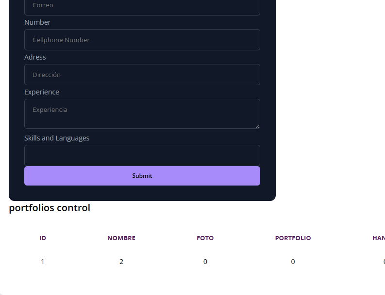

# Portafolio Web

> Este proyecto es un ejemplo de una página web de portafolio personal.

## Estructura del Proyecto

- `index.html`: El archivo HTML principal que define la estructura de la página.
- `css/`: Carpeta que contiene archivos CSS para los estilos de la página.
- `js/`: Carpeta que contiene archivos JavaScript para la funcionalidad de la página.
- `storage/`: Carpeta que puede contener datos relacionados con la cartera.

## Tecnologías Utilizadas

- HTML
- CSS
- JavaScript