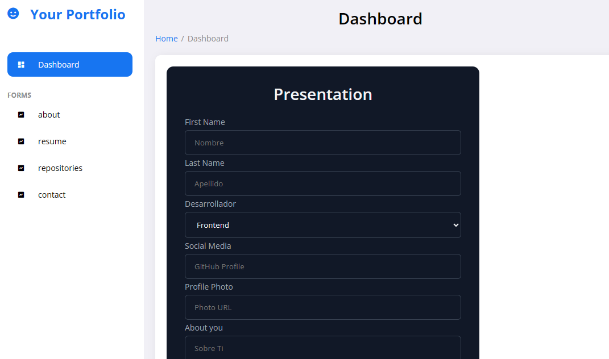
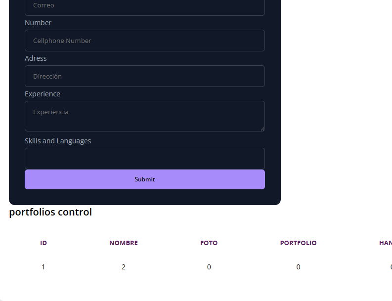
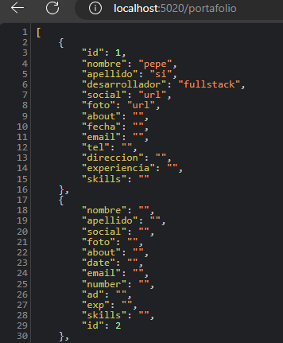
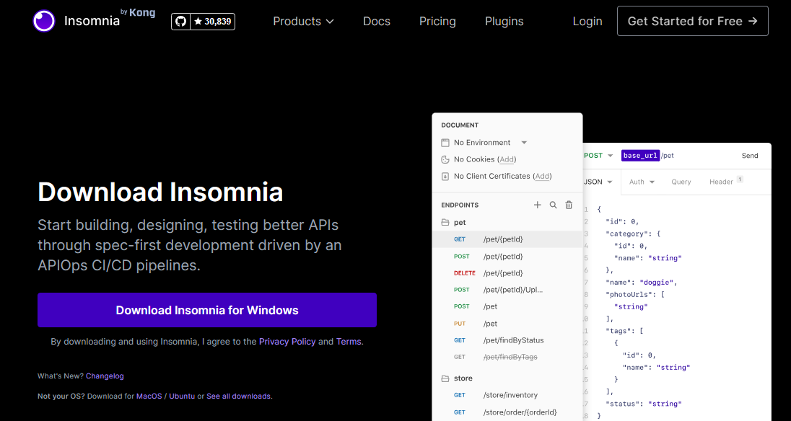
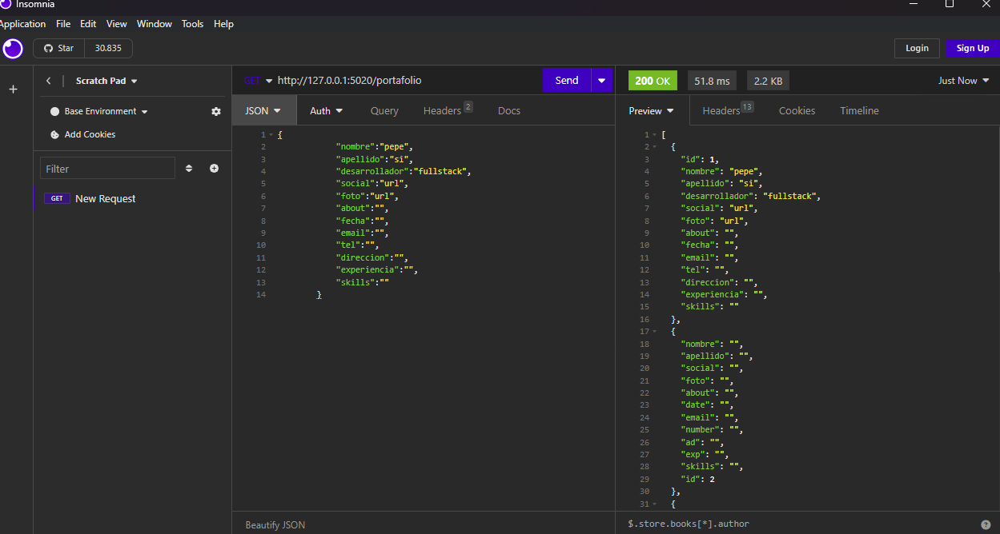
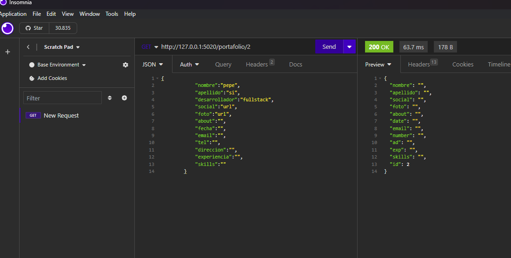
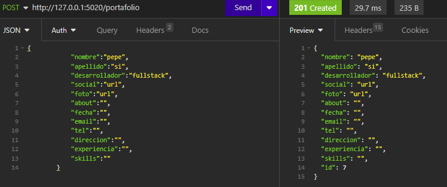
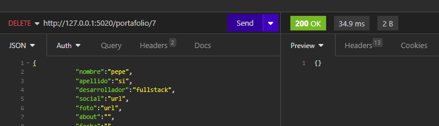
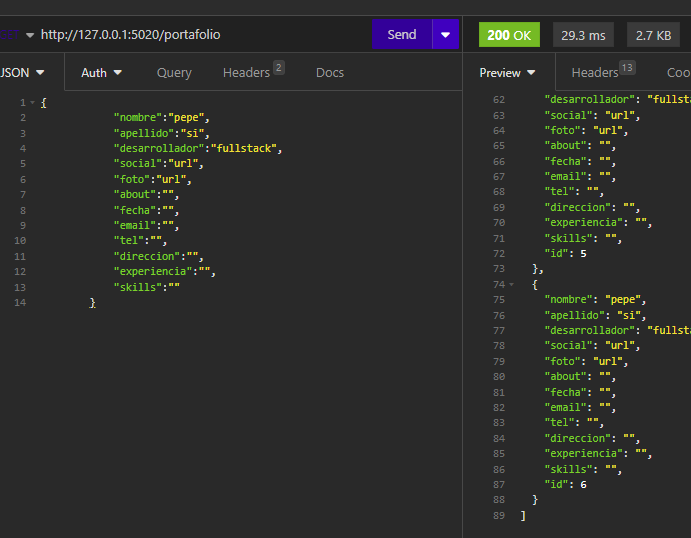

# Portafolio Web

> Este proyecto es un ejemplo de una página web de portafolio personal.

## Instrucciones

 Acceder a la API falsa

JSON Server creará una API REST falsa basada en tu archivo JSON. Puedes acceder a la API en tu navegador o mediante peticiones HTTP a  http://127.0.0.1:5500/index.html Por ejemplo, puedes visitar http://localhost:5020/portafolio para obtener los registros.

### Requisitos previos
- instalación de Node.js
https://nodejs.org/es

https://nodejs.org/en/download

#### Instalación en Windows o macOS

1. Descarga la versión LTS (versión de soporte a largo plazo).
2. Ejecuta el instalador descargado y sigue las instrucciones del asistente de instalación.
3. Una vez completada la instalación, abre la línea de comandos y verifica la instalación ejecutando:

   -`node -v` (para verificar la versión de Node.js)

   -`npm -v` (para verificar la versión de npm, el Node Package Manager).

#### Instalacion en Linux

1. Usa los siguientes comandos para instalar Node.js y npm
~~~ 
sudo apt install nodejs
sudo apt install npm

~~~

2. Una vez completada la instalación, verifica la instalación ejecutando los comandos:
~~~ 
node -v
npm -v
~~~ 

### Json Server
- instalación de paquetes y dependencias Json Server
https://www.npmjs.com/package/json-server

Abre la terminal o línea de comandos.

Ejecuta el siguiente comando para instalar JSON Server globalmente en tu sistema:

~~~
npm install -g json-server

~~~

- Iniciar JSON Server

En la terminal, navega al directorio donde se encuentra tu archivo JSON (por ejemplo, db.json).

Ejecuta el siguiente comando para iniciar JSON Server y utilizar tu archivo JSON como fuente de datos:
~~~
json-server --watch db.json
~~~

## Estructura del Proyecto
- `index.html`: El archivo HTML principal que define la estructura de la página.
- `portafolio.js`: Es el endpoint, se encuentran los métodos CRUD.
- `app.js`: Se importan los métodos y se hace el funcionamiento de ellos.
- `css/`: Carpeta que contiene archivos CSS para los estilos de la página.
- `js/`: Carpeta que contiene archivos JavaScript para la funcionalidad de la página.
- `storage/`: Carpeta que puede contener datos relacionados con la cartera.

## Tecnologías Utilizadas

- HTML
- CSS
- JavaScript

# Insomnia
> Para testear el api

GET ALL

GET ONE

POST

PUT

DELETE

> Se verifica que se elimino id 7

